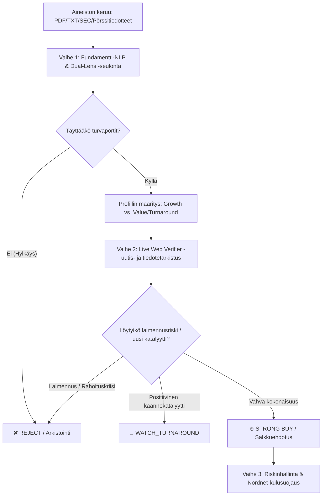

# 📈 tradeBotTiuku — Osakepoimintalogiikka ja -menetelmät

Tämä dokumentti kuvaa **tradeBotTiukun** osakepoimintaprosessin, seulontavaiheet, arviointikriteerit ja riskinhallintamenetelmät.

---

## 🧭 Yleiskuva ja Arkkitehtuuri

tradeBotTiukun osakepoiminta perustuu **monivaiheiseen seulontaputkeen (Multi-Stage Funnel)**, jossa yhdistyvät kvantitatiiviset suodattimet, tilinpäätösten ja raporttien tekoälypohjainen laadullinen analyysi (LLM NLP), reaaliaikaiset uutis- ja tiedotetarkistukset sekä automaattiset turvaportit.

---

## 🎯 Vaihe 0: Mikroyhtiöuniversumin Eristys (`universe_builder.py`)

Ennen fundamenttianalyysia ehdokasuniversumista eristetään tiukasti vain aidot mikroyhtiöt:
- **Markkina-arvon raja**: Tiukasti $< \$300\text{M}$ USD. Suuryhtiöt (kuten Nokia, Neste, Qt Group, Nvidia, AMD) suodatetaan automaattisesti pois.
- **Historiallinen valuuttakurssimuunnos**: EUR- ja SEK-kurssit muunnetaan USD-määräisiksi historiallisen raportointi-/signaalipäivän kurssilla ilman ennakkonäkemisharhaa (look-ahead bias).

---

## 🔍 Vaihe 1: Deterministiset Kovat Luvut & Fundamentti-NLP (`screener/financial_metrics_engine.py` & `screener/nlp_analyzer.py`)

Käsiteltävästä raportista (osavuosikatsaus, tilinpäätös tai SEC 10-Q/10-K) puretaan tase- ja tulosluvut deterministisellä Python-koodilla ennen tekoälykutsua. Tekoälymallille syötetään valmiiksi lasketut kovat faktat `[HARD FINANCIAL FACTS - DO NOT RECALCULATE]`. 

Yhtiöt arvioidaan kahteen eri profiiliin:

### Profiili A: Quality Hyper-Growth (Laadukas Kasvuyhtiö)
- **Kohde**: Skaalautuvat teknologia-, ohjelmisto- tai mikroyhtiöt, joilla on moninkertaistumispotentiaali ja terve taloudellinen selkäranka.
- **Päivitetyt Kriteerit**:
  - **Liikevaihdon kasvu**: $\text{YoY} > 20\%$.
  - **Korkea myyntikate**: $\text{Gross Margin} > 40\%$ (osoittaa hinnoitteluvoimaa ja skaalautuvuutta).
  - **Selviytymis- ja kassatesti**: Positiivinen liiketoiminnan rahavirta ($\text{OCF} > 0$) TAI kassan riittävyys $\ge 18\text{ kuukautta}$.
  - Laajeneva kokonaismarkkina (TAM) ja skaalautuva operatiivinen vipu.

### Profiili B: Deep Value & Turnaround (Arvoyhtiöt & Käännekandidaatit)
- **Kohde**: Voimakkaasti aliarvostetut tai liiketoimintansa tervehdyttäneet mikroyhtiöt.
- **Kriteerit**:
  - Matala arvostustaso suhteessa varoihin tai myyntiin (P/B, EV/S, P/E).
  - Taseen kestävyys: **nettovelattomuus** (`net_cash > 0`).
  - **Anti-Shrinking -sääntö**: Liikevaihdon lasku ei saa ylittää 10 % YoY ($\text{YoY} \ge -10\%$).
  - Kassan riittävyys vähintään 12–24 kuukaudeksi.
  - Merkkejä orgaanisesta kannattavuuskäänteestä tai kulurakenteen tehostumisesta.

### 🚫 Kovat Turvaportit & Älykäs Negointitunnistus
Yhtiö hylätään välittömästi (`REJECT`), mikäli yksikin seuraavista täyttyy, ellei lause sisällä eksplisiittistä negointia:
1. **Jatkuva omistaja-arvon laimennus**: Toistuvat suunnatut osakeannit, toksiset vaihtovelkakirjalainat tai aktiiviset ATM (*At-The-Market*) -ohjelmat. *(Huom: Jos uutisessa mainitaan "ATM terminated / permanently closed", riski on väistynyt eikä aiheuta hylkäystä).*
2. **Kassakriisi (Runway < 6 kk)**: Kassavarat loppumassa ilman selkeää ei-laimentavaa rahoitussuunnitelmaa tai positiivista liiketoiminnan rahavirtaa.
3. **Pohjoismaiset taseriskit**: Ruotsin osakeyhtiölain mukainen pakollinen `kontrollbalansräkning` tai `rekonstruktion`. *(Huom: Jos raportissa todetaan "ei tarvetta laatia kontrollbalansräkning-tasetta", negointi torjuu väärän hälytyksen).*
4. **Epämääräiset muotiliiketoiminnan käännökset**: Yhtiö vaihtaa toimialaa hype-teemoihin (kryptot, AI-kuoret) ilman todellista osaamista tai liikevaihtoa.
5. **Epäterve tase ja hallitsematon velkaantuminen**: Negatiivinen oma pääoma yhdistettynä kiihtyvään kassapolton vauhtiin.

---

## 🌐 Vaihe 2: Markkinakohtainen Reaaliaikainen Verifiointi (`screener/web_verifier.py`)

Koska kvartaaliraportit kuvaavat menneisyyttä, poimintalogiikka tekee automaattisen reaaliaikaisen uutis- ja tiedotetarkistuksen:

1. **Markkinakohtainen Reititys (`detect_market`)**:
   - 🇫🇮 **Suomi (`.HE`)**: Suomenkieliset pörssitiedotteet ja uutiset (`fi-FI`), Cision, GlobeNewswire, Kauppalehti, Arvopaperi.
   - 🇸🇪 **Ruotsi (`.ST`)**: Ruotsinkieliset tiedotekanavat (`sv-SE`), MFN, Spotlight, Aktietorget, Dagens Industri.
   - 🇺🇸 **USA (`US`)**: SEC-tiedotteet, PR Newswire, BusinessWire, Yahoo Finance (`en-US`).
2. **Kielikohtainen Sanasto & Taivutustunnistus**:
   - *Riskisanat*: `osakeanti`, `suunnattu anti`, `yrityssaneeraus`, `företrädesemission`, `kontrollbalansräkning`, `dilution`, `ATM offering`.
   - *Katalyyttisanat*: `suurtilaus`, `merkittävä sopimus`, `yrityskauppa`, `positiivinen tulosvaroitus`, `stororder`, `förvärv`, `turnaround`.
3. **Monikielinen LLM-synteesi**:
   - Yhdistää raportin fundamenttitiedot ja tuoreimmat uutiset.
   - Jos tuore uutinen paljastaa esimerkiksi uuden osakeannin, tuomio lasketaan tasolle `REJECT`.
   - Jos yhtiö saa merkittävän suurtilauksen tai sopimuksen, se nostetaan tasolle `WATCH_TURNAROUND` tai `STRONG BUY`.

---

## 🎯 Vaihe 3: Tuomiot ja Luokittelu

Analyysin lopputuloksena jokaiselle yhtiölle asetetaan selkeä tuomio:

| Tuomio | Tunnus | Kuvaus & Toimenpide |
| :--- | :---: | :--- |
| **STRONG BUY** | 🔥 | Huippuluokan fundamentit, vahva tase, ei laimennusriskiä, selkeä katalyytti. Ehdotetaan ostolistalle / salkkuun. |
| **WATCH_TURNAROUND** | 👀 | Potentiaalinen käänneyhtiö, jossa havaittu positiivinen uutiskatalyytti. Siirretään erilliselle käännelistalle (`watchlist_turnarounds.csv`). |
| **HOLD** | 🟡 | Kohtuullinen yhtiö ilman välitöntä osto- tai myyntikatalyyttiä. Seurataan tilannetta. |
| **REJECT** | ❌ | Ei täytä laatukriteerejä: laimennusriski, heikko tase, riittämätön kassa tai heikko kannattavuus. |

---

## 🛡️ Vaihe 4: Riskinhallinta ja Nordnet-Kulusuojaus

Ennen toimeksiannon suosittelemista tai paper trading -kirjausta sovelletaan kulusuojausta ja positiokoon sääntöjä:

1. **Nordnet-Palkkiomalli (Taso 3)**:
   - **Helsinki (`.HE`)**: 7,00 € minimi / 0,15 %.
   - **USA / Ulkomaat**: 15,00 $/€ minimi / 0,15 %.
   - **Pikkukauppasuoja**: Kauppaa ei suositella, jos välityspalkkio ylittää 2,5 % kauppasummasta.
2. **Mekaaninen 20 % Liukuva Tappionpysäytys (Trailing Stop-Loss)**:
   - Jokaiselle hyväksytylle mikroyhtiöpositiolle asetetaan automaattinen 20 % liukuva stop-loss (`highest_seen * 0.80`).
   - Leikkaa tehokkaasti mikroyhtiöiden katastrofaaliset pudotukset (kuten -96.4 % -> -26.0 %) ja vapauttaa pääoman kiertoon keskimäärin ~40 päivässä.
3. **Kassanhallinta & Positiokoko (Fractional Half-Kelly)**:
   - Positiokoko rajataan puolen Kellyn kriteerillä (`Half-Kelly ~ 9.99 %`), mikä ehkäisee mikroyhtiöiden volatiliteetista johtuvaa ylipanostamista.
   - Toro-Bouchaud -neliöjuurilain mukainen likviditeettisakko huomioi tilauskoon suhteessa päivävaihtoon.
4. **Strategiaprofiilit**:
   - `SWING_TRADING`: Tiukat voittojen kotiutukset (+10 % TP, -8 % SL) ja nopea reagointi.
   - `LONG_TERM`: Osta ja pidä (+50 % TP, laaja liukuma), ei myyntiä lyhyen aikavälin heilunnasta.
   - `HYBRID`: ETF-rahastoille pitkä pito, suorille osakepoiminnoille aktiivinen riskinhallinta.
5. **Hälytysten Jäähdytys (24h Cooldown)**:
   - Järjestelmä estää spämmisähköpostit tarkistamalla SQLite-tietokannasta (`sent_alerts`), onko samasta osakkeesta jo lähetetty hälytys viimeisen 24 tunnin aikana.
