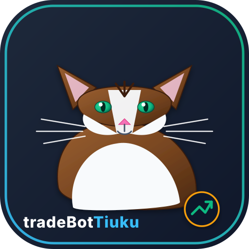

# 🐱 tradeBotTiuku — Avointen Lähteiden Salkunneuvonantaja & Advisory AI Agent



**tradeBotTiuku** on Python-pohjainen, paikallisesti toimiva salkunseuranta- ja uudelleentasapainotuksen neuvonantaja-agentti. Koska suoraa pankki-API-yhteyttä (kuten Nordnet API) ei ole saatavilla uusille asiakkaille, Tiuku toimii täysin itsenäisenä **avointen lähteiden markkina-älyagenttina (Advisory Agent)**. Järjestelmä laskee salkun arvon, tekee teknisen ja AI-pohjaisen analyysin sekä tuottaa valmiit toimenpide-ehdotukset (Checklist) ja visuaalisen suomenkielisen HTML-dashboardin ihmisen hyväksyttäväksi (*Human-in-the-loop*).

---

## 🌟 Tärkeimmät Ominaisuudet

- **📊 ETF-Seurantalista & Dippi-Indikaattorit (`etf_watchlist.json`)**: Erillinen luokiteltu seurantalista (Maailma-indeksit, USA, Eurooppa/Pohjoismaat, Osinko/Value, Teemat & Sektorit, Korkorahastot). Tiuku laskee ETF-rahastoille indeksisijoittamiseen räätälöidyt **Buy the Dip** -signaalit (RSI ≤ 40, hinta alle 50d keskiarvon) kuukausisäästön kohdentamiseksi.
- **📥 Nordnet CSV-Salkuntuonti**: Tuo omistukset, kappalemäärät ja keskihinnat automaattisesti Nordnetin viemästä CSV-/sivutaulukkotiedostosta (`--import-csv`).
- **📁 Tiedostopohjainen Salkunseuranta**: Lukee omistukset, määrät ja hankintahinnat paikallisesta `tiuku_portfolio.json` -tiedostosta.
- **📈 Avointen Lähteiden Markkinadata (`yfinance`)**: Hakee reaaliaikaiset kurssit ja tekniset indikaattorit (RSI, Bollinger %B, SMA/EMA) ilmaiseksi ilman maksullisia API-avaimia.
- **🔒 HODL / Lottolappu -Suojapuskuri**: Voit lukita yksittäisiä osakkeita (esim. Faron), jotta automaattinen myyntiehdotus ei koskaan koske niihin.
- **🛡️ Nordnet Palkkiotasot & Markkinakohtainen Kulusuojaus**:
  - **OMX Helsinki (`.HE`)**: Kotimaan Taso 3 minimipalkkio 7,00 € / 0,15 %.
  - **Ulkomaiset pörssit (Saksa `.DE`, Lontoo `.L`, USA)**: Ulkomaankaupan minimipalkkio 15,00 € / 0,15 %.
  - **Nordnet-rahastot (`NN_NORGE`, `NN_SVERIGE`)**: 0,00 € välityspalkkio.
  - Suodattaa automaattisesti pois pikkukaupat, joiden välityspalkkiokulut ylittäisivät 2,5 % kauppasummasta.
- **🎯 Conviction Alignment**: Osto-ohjelmaan pääsevät vain osakkeet, joiden tekninen AI-arvio antaa selkeän ostosuosituksen (`BUY` / `STRONG_BUY`).
- **🌐 Visuaalinen Suomenkielinen HTML Dashboard & Tooltipit**: Generoi jokaisen ajokerran yhteydessä `tiuku_dashboard.html` -näkymän. Instrumenttien täydellinen nimi näkyy suoraan sekä hiiren leijutuksella (mouseover), mikä helpottaa toimeksiantojen hakua Nordnetissä.

---

## 🚀 Asennus ja Käyttö

### 1. Riippuvuuksien asennus
```bash
python -m venv .venv
source .venv/bin/activate  # Windows: .venv\Scripts\activate
pip install -r requirements.txt
```

### 2. Ympäristömuuttujat (`.env`)
Kopioi mallitiedosto `.env.example` nimelle `.env`:
```bash
cp .env.example .env
```
Määritä tarvittaessa OpenAI API-avain sekä sähköpostiraportoinnin asetukset (`ENABLE_EMAIL_REPORTS`):
```env
OPENAI_API_KEY="your-api-key-here"
NORDNET_FEE_TIER=3

# Sähköpostiraportointi (SMTP)
ENABLE_EMAIL_REPORTS="true"
SMTP_SERVER="smtp.gmail.com"
SMTP_PORT=587
SMTP_USERNAME="oma.sahkoposti@gmail.com"
SMTP_PASSWORD="sovelluskohtainen-salasana"
EMAIL_TO="vastaanottaja@domain.com"
```

### 3. Salkun Päivittäminen & Nordnet CSV-Sisäänluku

Tuo omistukset, määrät ja hankintahinnat suoraan Nordnetin viemästä CSV-/taulukkotiedostosta:
```bash
python main.py --import-csv "data/Osaketaulukko salkkunro 14583629 5.8.2026.csv"
```

Muita hyödyllisiä komentoja salkun hallintaan:
```bash
# Näytä nykyinen salkun tila
python main.py --show-portfolio

# Päivitä käteissaldo (EUR)
python main.py --set-cash 1191.00

# Lisää tai päivitä yksittäinen omistus käsin
python main.py --set-holding NESTE.HE 100 29.50
```

### 4. Aja Analyysisykli & Ajastus

Aja viikkoanalyysi, luo dashboard ja lähetä sähköpostiraportti kerran:
```bash
python main.py --run-once
```

#### Tapa A: Windows Tehtävien Ajoitus (Suositeltu)
Voit ajastaa ajon ajettavaksi automaattisesti esim. joka maanantai klo 09:00 ilman että ikkunaa tarvitsee pitää auki:
Aja PowerShellissä (järjestelmänvalvojana):
```powershell
$action = New-ScheduledTaskAction -Execute "py.exe" -Argument "c:\Users\Jarmo\Documents\kode\trade\tradeBotTiuku\main.py --run-once" -WorkingDirectory "c:\Users\Jarmo\Documents\kode\trade\tradeBotTiuku"
$trigger = New-ScheduledTaskTrigger -Weekly -DaysOfWeek Monday -At 09:00AM
Register-ScheduledTask -TaskName "TradeBotTiukuViikkoajo" -Action $action -Trigger $trigger
```

#### Tapa B: Pythonin Jatkuva Tausta-ajastin
Käynnistä Pythonin oma jatkuva tausta-ajastin:
```bash
python main.py --schedule
```
(Ajaa analyysin `.env`-tiedostossa määritettynä viikonpäivänä `WEEKLY_REPORT_DAY="monday"`).

---

## 📊 ETF-Seurantalista & Kuukausisäästön Dippianalyysi

Tiuku osaa seurata ja analysoida laajoja indeksirahastoja (ETF) erillisen [etf_watchlist.json](file:///c:/Users/Jarmo/Documents/kode/trade/tradeBotTiuku/data/etf_watchlist.json) -tiedoston kautta.

### Seurattavat Kategoriat:
- **Maailma-indeksit (Core):** `EUNL.DE` (IWDA), `VWCE.DE`, `SPPW.DE`, `IS3N.DE`
- **USA & Pohjois-Amerikka:** `SXR8.DE` (S&P 500 Acc), `VUSA.DE` (S&P 500 Dist), `EQQQ.DE` (Nasdaq-100)
- **Eurooppa & Pohjoismaat:** `IMEU.DE`, `XACT-NORDIC.ST`, `EXV1.DE`
- **Osinko- ja Arvosijoittaminen:** `VHYL.DE`, `WDIV.DE` (IGWD), `IDVY.DE`
- **Teema- ja Sektorirahastot:** `IITV.DE` (US Tech), `IQQH.DE` / `INRG.L` (Clean Energy), `RBOT.DE` (Robotics/AI), `ISPY.DE` (Healthcare)
- **Korkorahastot:** `IB01.L` (US Short Treasury), `SEGA.DE` (Euro Corporate Bonds)

### Miten Dippianalyysi Toimii?
Koska indeksirahastot eivät heilahda rajusti kuin yksittäiset krypto- tai kasvuosakkeet, Tiuku arvioi niitä arvostustasojen, dippien (*Buy the Dip*) ja kuukausisäästön kohdentamisen kannalta:
- **RSI-Dippi:** Jos indeksi ottaa dipin (RSI ≤ 40), pisteytys nousee välittömästi.
- **Keskiarvodippi (SMA50):** Jos hinta tippuu 50 päivän keskiarvon alapuolelle, Tiuku tunnistaa ostopaikan.
- **Nouseva Trendi (SMA200):** Jos pitkän aikavälin nouseva trendi on voimassa, dippiostoehdotus saa korkean arvosanan (8/10–9/10): *"Hyvä lisäyspaikka kuukausisäästölle"*.

Uusia ETF-rahastoja voi lisätä suoraan mukauttamalla [etf_watchlist.json](file:///c:/Users/Jarmo/Documents/kode/trade/tradeBotTiuku/data/etf_watchlist.json) -tiedostoa.

---

## 📂 Repositorion Rakenne

```
tradeBotTiuku/
├── tiuku.svg                # Tiuku-kissan tavaramerkki/app-ikoni
├── tiuku_dashboard.html     # Visuaalinen selain-dashboard
├── tiuku_portfolio.json     # Paikallinen salkun tila
├── main.py                  # Pääkäynnistystiedosto
├── config.py                # Järjestelmäasetukset & Nordnet-palkkiotasot (kotimaa/ulkomat)
├── clients/
│   ├── market_data_client.py# yfinance-markkinadatayhteys & indikaattorit
│   └── nordnet_client.py    # Advisory-tilan salkkulaskenta
├── core/
│   ├── ai_advisor.py        # 1-10 Pisteytys & Tekninen AI-analyysi
│   ├── rebalancer.py        # Uudelleentasapainotus & Conviction-logiikka
│   └── risk_manager.py      # Stop Loss & Kulusuojaus
├── reporting/
│   └── weekly_reporter.py   # Suomenkielinen Markdown & HTML Dashboard -generaattori
└── utils/
    └── csv_importer.py      # Nordnet CSV/tab -salkuntuontimoduuli
```

---

## 🔒 Tietosuoja & Disclaimer

- Järjestelmä toimii 100 % paikallisesti omalla laitteellasi.
- *Ei automaattista toimeksiantojen suoritusta* — kaikki kaupat suoritetaan ihmisen toimesta (Human-in-the-loop).
