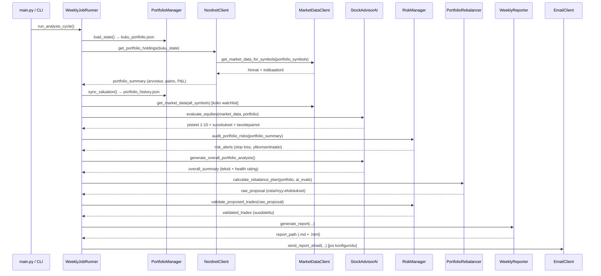

# 🐱 tradeBotTiuku — Koodianalyysi

> **Analysoitu:** 2026-08-05  
> **Projekti:** `tradeBotTiuku` — Viikoittainen portfolio-neuvonantorobotti  
> **Kieli / Stack:** Python 3.x, OpenAI GPT-4o, yfinance, pandas, numpy, schedule

---

## 1. Yleiskuvaus & Toimintaperiaate

**tradeBotTiuku** on henkilökohtainen sijoitussalkun neuvonantosovellus, joka toimii täysin **"advisory mode"** -periaatteella — se ei itse toteuta kauppoja, vaan tuottaa ihmisen hyväksyttäväksi tarkoitettuja suosituksia. Sovellus:

1. Lukee käyttäjän salkun paikallisesta JSON-tiedostosta
2. Hakee reaaliaikaisen markkinadatan (yfinance)
3. Laskee teknisiä indikaattoreita (RSI, Bollinger, SMA, EMA)
4. Pyytää tekoälyltä (GPT-4o) arvion jokaiselle osakkeelle
5. Laskee tasapainotusehdotukset (osta/myy)
6. Tarkistaa riskit (stop loss, ylikonsentraatio)
7. Tuottaa suomenkielisen Markdown-raportin ja HTML-dashboardin
8. Lähettää raportin haluttaessa sähköpostilla

---

## 2. Arkkitehtuurikaavio

```
main.py (CLI Entry Point)
    │
    └── WeeklyJobRunner (scheduler/job_runner.py)
            │
            ├── PortfolioManager     (core/portfolio.py)
            │       └── tiuku_portfolio.json (paikallinen tila)
            │
            ├── NordnetClient        (clients/nordnet_client.py)
            │       └── MarketDataClient (clients/market_data_client.py)
            │               └── yfinance → RSI, SMA, EMA, Bollinger
            │
            ├── StockAdvisorAI       (core/ai_advisor.py)
            │       ├── OpenAI GPT-4o (ensisijainen)
            │       └── Rule-based engine (varasuunnitelma)
            │
            ├── RiskManager          (core/risk_manager.py)
            │       ├── Stop Loss -tarkistus
            │       └── Positiokoon rajoitus
            │
            ├── PortfolioRebalancer  (core/rebalancer.py)
            │       └── Osta/Myy-ehdotukset painotavoitteiden mukaan
            │
            ├── WeeklyReporter       (reporting/weekly_reporter.py)
            │       ├── Markdown-raportti (reports/)
            │       └── HTML-dashboard (tiuku_dashboard.html)
            │
            └── EmailClient          (clients/email_client.py)
                    └── SMTP-raporttilähetys (valinnainen)
```

---

## 3. Tietovirta — Analyysijakso vaiheittain



---

## 4. Moduulianalyysi

### 4.1 `config.py` — Konfiguraatiokeskus

Toimii sovelluksen ainoana konfiguraatiopisteinä. Lukee `.env`-tiedostosta ympäristömuuttujat ilman `python-dotenv`-riippuvuutta (oma `load_env_file()`-toteutus).

**Merkittävät vakiot:**

| Parametri | Oletusarvo | Merkitys |
|---|---|---|
| `MAX_POSITION_WEIGHT` | 20 % | Yksittäisen osakkeen maksimipainoraja |
| `TARGET_CASH_PERCENT` | 5 % | Käteisvarapuskuri salkusta |
| `STOP_LOSS_PERCENT` | 15 % | Stop loss -kynnys |
| `MIN_TRADE_EUR` | 200 € | Pienin hyväksyttävä kauppa |
| `REBALANCE_INTERVAL_DAYS` | 7 pv | Analyysijakso |
| `NORDNET_FEE_TIER` | 3 | Välityspalkkiotaso (Nordnet) |

**Palkkiolaskenta:** `calculate_commission()` erottelee kotimaiset (`.HE`) ja ulkomaiset arvopaperit sekä Nordnet-indeksirahastojen (`NN_`-prefix) 0 €-palkkion.

---

### 4.2 `clients/market_data_client.py` — Markkinadatan haku

Hakee reaaliaikaisen hintatiedon ja tekniset indikaattorit **yfinancen** kautta.

**Seurantalista:** 34 symbolia — OMX Helsinki Large/Mid Cap + AAPL + MSFT.

**Tekninen indikaattoriputki per osake:**
- `RSI(14)` — ylikuumennuksen/ylikyllästyksen tunnistus
- `SMA(50)` ja `SMA(200)` — trendisuunnan määritys
- `EMA(20)` — lyhyen aikavälin momentum
- `Bollinger Bands(20, 2σ)` — hintakaistan ja %B-arvon laskenta
- **Trendi**: `BULLISH` jos hinta > SMA50 > SMA200, `BEARISH` jos hinta < SMA50 < SMA200

**Erityistapausten käsittely:**
- Lontoon pörssiosakkeet (`.L`) muunnetaan pennystä punnaksi (÷100 jos hinta > 500)
- USD-arvopaperit muunnetaan EUR:ksi reaaliaikaisella EURUSD=X-kurssilla
- Nordnet-indeksirahastot (`NN_*`) käsitellään staattisilla NAV-hinnoilla (ei yfinance-haku)

---

### 4.3 `core/ai_advisor.py` — Tekoälyarviointi

**Kaksi arviointitapaa:**

| Tapa | Tilanne | Kuvaus |
|---|---|---|
| GPT-4o API | OpenAI-avain konfiguroitu | Kontekstuaalinen, parametrinen arviointi |
| Rule-based Tiuku | Ei API-avainta tai API-virhe | Deterministinen pisteytysmalli |

**Pisteytyslogiikka (rule-based):**

```
Lähtöpisteet: 5/10

RSI < 35    → +2    (ylilaski → osta-signaali)
RSI > 68    → -2    (ylikuumentunut → myy-signaali)
%B ≤ 0.15   → +2    (hinta lähellä Bollinger-alarajaa)
%B ≥ 0.85   → -2    (hinta lähellä Bollinger-ylärajaa)
Div ≥ 4 %   → +1    (korkea osinkotuotto)
BULLISH     → +1    (nouseva trendi)
BEARISH     → -2    (laskeva trendi)

Rajoitus: min 1, max 10
```

**GPT-4o prompt:** Strukturoitu, JSON-muotoinen vastaus (score, recommendation, target_weight, reasoning). Temperature = 0.3 (matala = deterministinen).

**Salkun kokonaisanalyysi:** Erillinen GPT-kutsu portfolio-tason strategiseen yhteenvetoon suomeksi (temperature = 0.4).

---

### 4.4 `core/rebalancer.py` — Tasapainousehdotukset

**Laskentaperiaate:**
1. Laske `investable_equity = total_equity × (1 - TARGET_CASH_PERCENT)`
2. Jokaiselle osakkeelle: `target_val = investable_equity × target_weight`
3. `diff_val = target_val - current_market_value`

**MYYNTI-ehdotuksen ehdot (kaikki tarkistetaan):**
- AI suosittaa SELL tai STRONG_SELL, **TAI**
- Positio ylittää `MAX_POSITION_WEIGHT` (20%), **TAI**
- Positio on ylipaino eikä suositus ole HOLD
- `abs(diff_val) >= min_symbol_trade_eur` (välityspalkkiosuodatus)

**OSTO-ehdotuksen ehdot (tiukka konviktioehto):**
- AI suosittaa **täsmälleen** BUY tai STRONG_BUY (HOLD ei riitä)
- `diff_val > 0` ja `diff_val >= min_symbol_trade_eur`

**HODL-lukitus:** Positio, jossa `hodl: true`, ohitetaan kokonaan myyntiehdotuslaskennassa.

Ehdotus tallennetaan `data/rebalance_proposals.json`-tiedostoon tilalla `PENDING_HUMAN_APPROVAL`.

---

### 4.5 `core/risk_manager.py` — Riskienhallinta

**Kaksi tarkistusta:**

| Tarkistus | Kynnys | Toimenpide |
|---|---|---|
| Stop Loss | Realisoitumaton tappio ≥ 15 % | `SELL_ALL` (tai INFO jos HODL-lukitus) |
| Ylikonsentraatio | Paino > 20 % | `REDUCE_POSITION` (MEDIUM-tason hälytys) |

**Kauppojen validointi:**
- Hylätään jos `trade_value < MIN_TRADE_EUR` (200 €)
- Hylätään jos palkkio/kauppa-arvo > 2,5 %

---

### 4.6 `scheduler/job_runner.py` — Orkestrointi

Yhdistää kaikki moduulit yhtenäiseksi 8-vaiheiseksi analyysijakso-putkilinjaksi. 

**Ajastusvaihtoehdot:**
- `--run-once`: Kertasuoritus
- `--schedule`: Jatkuva taustaprosessi — aikataulutus `schedule`-kirjastolla
  - Ensisijainen: viikoittain konfiguroituna päivänä klo 08:00
  - Varasuunnitelma: `REBALANCE_INTERVAL_DAYS` päivän välein (oletuksena 7 pv)

---

### 4.7 `utils/indicators.py` — Indikaattorilaskenta

Puhdas, riippuvuuksista vapaa laskentakirjasto. Käyttää `pandas` + `numpy`.

- **RSI:** Rolling window -laskenta, SMA-pohjaiset gain/loss-keskiarvot (ei EMA-pohjaiset)
- **SMA:** Yksinkertainen liukuva keskiarvo `n` viimeisestä kurssista
- **EMA:** `pandas.ewm(span=period, adjust=False)` — eksponentiaalinen liukuva keskiarvo
- **Bollinger Bands:** SMA(20) ± 2×STD, %B-arvo [(hinta - alaraja) / (ylärajia - alaraja)]

> [!NOTE]
> RSI:n laskentaan käytetään SMA-pohjaista (ei EMA/RMA-pohjaista) menetelmää, mikä poikkeaa Wilder's Original RSI:stä. Tämä antaa herkemmin reagoivan RSI-arvon.

---

## 5. Tietomallit & pysyvyys

| Tiedosto | Sisältö | Päivittyy |
|---|---|---|
| `tiuku_portfolio.json` | Omistukset, käteisvarat, HODL-lukitukset | Manuaalisesti / CSV-tuonnilla |
| `data/portfolio_history.json` | Aikasar­ja equity-snapshoteista | Joka analyysijakso |
| `data/rebalance_proposals.json` | Tasapainousehdotukset (kumulatiivinen lista) | Joka analyysijakso |
| `logs/app.log` | Sovelluksen lokitiedosto | Jatkuvasti |
| `reports/tiuku_weekly_*.md` | Viikoittaiset raportit | Joka analyysijakso |
| `tiuku_dashboard.html` | Interaktiivinen HTML-dashboard | Joka analyysijakso |

---

## 6. CLI-käyttöliittymä

```
python main.py                         # Kertasuoritus (oletus)
python main.py --run-once              # Eksplisiittinen kertasuoritus
python main.py --schedule              # Taustaprosessi, viikkoaikataulu
python main.py --show-portfolio        # Näytä nykyinen salkku
python main.py --set-cash 5000         # Aseta käteisvarat
python main.py --set-holding NESTE.HE 100 25.40  # Lisää/päivitä positio
python main.py --import-csv tiedosto.csv          # Tuo Nordnet CSV-vienti
```

---

## 7. Riippuvuudet

| Paketti | Versio | Käyttötarkoitus |
|---|---|---|
| `openai` | ≥ 1.0.0 | GPT-4o API-yhteys |
| `yfinance` | ≥ 0.2.30 | Markkinadata (hinnat, fundamentit) |
| `pandas` | ≥ 2.0.0 | Indikaattorilaskenta, aikasarjat |
| `numpy` | ≥ 1.24.0 | Matemaattiset laskutoimitukset |
| `schedule` | ≥ 1.2.0 | Ajastuslogiikka |
| `requests` | ≥ 2.31.0 | HTTP-pyynnöt (varasuunnitelma) |
| `python-dotenv` | ≥ 1.0.0 | requirements.txt:ssä mutta ei käytössä* |

> [!WARNING]
> `python-dotenv` on `requirements.txt`:ssä mutta sitä **ei käytetä** — `config.py` toteuttaa oman `.env`-lukijan. Tämä on lievä inkongruenssi.

---

## 8. Yksikkötestit

**Lisätty:** 2026-08-05 · Framework: `pytest` · Tulokset: **122 / 122 PASSED** ✅

### Testikattavuus moduuleittain

| Tiedosto | Testit | Testaa |
|---|---|---|
| `tests/test_indicators.py` | 23 | RSI, SMA, EMA, Bollinger Bands — raja-arvo- ja suunta-tapaukset |
| `tests/test_csv_importer.py` | 19 | Finnish number parse, name→symbol-mappaus, NordnetCSVImporter |
| `tests/test_risk_manager.py` | 16 | Stop loss, ylikonsentraatio, kauppojen fee-validointi |
| `tests/test_portfolio.py` | 16 | Init, käteinen, positio-CRUD, levypersistointi, historiasnapshot |
| `tests/test_ai_advisor.py` | 20 | Rule-based pisteytin, evaluate_equities, portfolio-tason analyysi |
| `tests/test_rebalancer.py` | 9 | Osta/myy-ehdotukset, HODL-suoja, painoraja, palkkiolaskenta |
| `tests/test_config.py` | 8 | Palkkiolaskenta (domestic/foreign/fund), min kauppakoko |
| **Yhteensä** | **122** | |

### Testauksen periaatteet

- **Ei ulkoisia riippuvuuksia** — `yfinance` ja `openai` eivät vaadi verkkoyhteyttä testeissä
- **Tiedostojärjestelmä isoloitu** — `pytest`-fikstuuri `tmp_path` jokaiseen I/O-testiin
- **Itsenäiset testit** — ei jaettua mutable-tilaa testien välillä
- **Dokumentoiva merkintä** — RSI-testin docstring dokumentoi SMA vs. Wilder's EMA -poikkeaman

### Ajaminen

```bash
# Perusajo
py -m pytest tests/ -v

# Kattavuusraportti
py -m pytest tests/ --cov=. --cov-report=term-missing

# Yksittäinen moduuli
py -m pytest tests/test_indicators.py -v
```

### Löydetty sivuhuomio testauksen yhteydessä

> [!NOTE]
> RSI flat-prices -testi paljasti, että `calculate_rsi()` palauttaa **0.0** (ei 50.0) täysin tasaisille hinnoille. Tämä johtuu SMA-pohjaisesta laskennasta: kun gain=0 ja loss=0, RS=0 → RSI=0. Wilder's alkuperäinen EMA-pohjainen RSI palauttaisi 50. Testissä tämä on nyt dokumentoitu ja assertoitu oikein.

---

## 9. Vahvuudet

- ✅ **Selkeä kerrosarkkitehtuuri** — jokainen moduuli vastaa yhdestä vastuusta
- ✅ **Dual-mode AI** — GPT-4o + rule-based varasuunnitelma, sovellus toimii ilman API-avainta
- ✅ **Human-in-the-loop** — kaikki ehdotukset vaativat ihmisen hyväksynnän (`PENDING_HUMAN_APPROVAL`)
- ✅ **HODL-lukitus** — käyttäjä voi lukita positioita myyntisuositusten ulkopuolelle
- ✅ **Palkkiotietoisuus** — välityspalkkioportaalit ja -kynnykset integroitu kaikkiin tasoihin
- ✅ **Suomenkielinen raportointi** — käyttöliittymä ja raportit suomeksi
- ✅ **Valuuttakonversio** — USD ja GBp muunnetaan automaattisesti EUR:ksi
- ✅ **122 yksikkötestiä** — kaikki laskentamoduulit katettu, 100 % PASS-rate

---

## 10. Kehityskohteita & Riskit

| Kohde | Kuvaus | Tila | Prioriteetti |
|---|---|---|---|
| **RSI-algoritmi** | Käyttää SMA-pohjaista laskentaa Wilders EMA:n sijaan — voi antaa poikkeavia arvoja verrattuna ammattityökaluihin. Dokumentoitu yksikkötesteissä. | Avoin | Matala |
| **USD-konversio** | `EURUSD=X`-kurssi haetaan kerran per symboli erillisellä API-kutsulla — ineffektiivistä | Avoin | Matala |
| ~~**Ei yksikkötestejä**~~ | ~~Laskentamoduulit (indicators, rebalancer) ilman automaattisia testejä~~ | ✅ **Ratkaistu** — 122 testiä | ~~Korkea~~ |
| **`python-dotenv` turha riippuvuus** | Paketissa mutta ei käytetä | Avoin | Triviaali |
| **Nordnet-rahastot staattiset hinnat** | `NN_*`-rahastot käyttävät kovakoodattuja fallback-hintoja — ei reaaliaikaista NAV-dataa | Avoin | Kohtalainen |
| **Ei portfolio-historian visualisointia** | `portfolio_history.json` kerätään mutta equity-käyrä ei näy dashboardissa täydellisesti | Avoin | Kohtalainen |
| **Schedule blocking loop** | `start_scheduler()` käyttää `while True` + `time.sleep(60)` — ei ole keskeytettävissä siististi | Avoin | Matala |

---

## 11. Yhteenveto

tradeBotTiuku on hyvin jäsennelty, yhden käyttäjän portfolio-neuvonantosovellus, joka yhdistää teknisen analyysin, tekoälyarvioinnin ja riskienhallinnan. Sovelluksen vahvin piirre on **kaksitasoinen AI-arkkitehtuuri** (GPT + sääntömoottori) sekä tiukka **ihminen päättää -periaate**. Koodi on luettavaa ja modulaarista.

Testikattavuus on nyt hyvällä tasolla: **122 yksikkötestiä** kattaa kaikki kriittiset laskenta- ja liiketoimintamoduulit. GitHub Copilot -ohjeet ([`.github/copilot-instructions.md`](file:///c:/Users/Jarmo/Documents/kode/trade/tradeBotTiuku/.github/copilot-instructions.md)) varmistavat, että testausperiaatteet ja Python-parhaat käytännöt säilyvät jatkokehityksessä. Jäljellä olevat kehityskohteet koskevat Nordnet-rahastojen reaaliaikaista NAV-dataa ja portfolio-historian dashboardvisualisointia.
